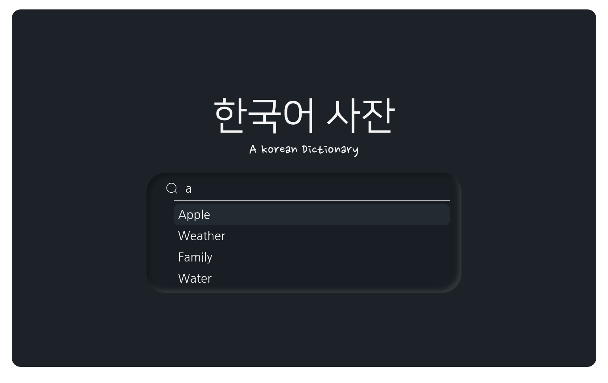
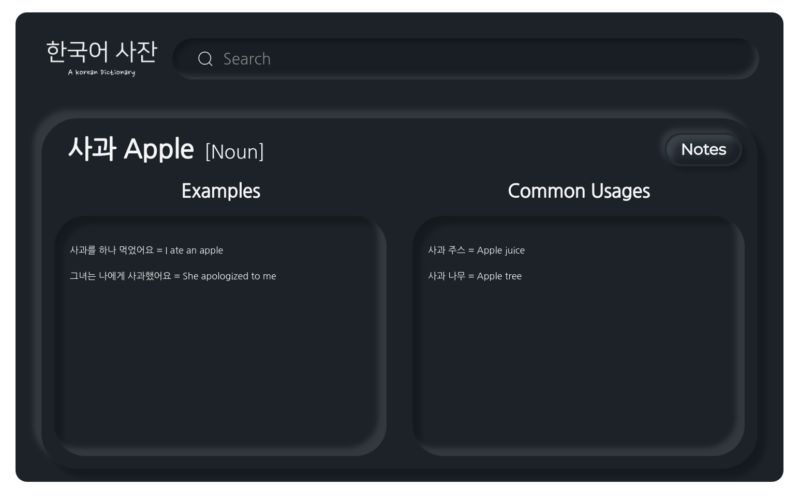

# Korean Dictionary

<div align="center">
  
  
</div>

Korean Dictionary is a minimal, neumorphic desktop app for searching English and Korean words in a simple, fast, and visually appealing interface. Built with Electron, Vite, and React, it features Framer Motion animations, Zustand state management, modular Sass styling, custom keyboard navigation, debounced search, and a REST API backend with MongoDB for instant, distraction-free results.

## Features

- **Bilingual Search:** Instantly search for English or Korean words.
- **Desktop App:** Built with Electron, runs cross-platform.
- **Neumorphic UI:** Clean, modern design.
- **Smooth Animations:** Powered by Framer Motion.
- **State Management:** Uses Zustand for fast and simple state management.
- **REST API Backend:** Connects to a separate server process via REST API.
- **MongoDB Database:** Dictionary data is stored in MongoDB.

## Tech Stack

- [Electron](https://www.electronjs.org/) + [Vite](https://vitejs.dev/) + [React](https://react.dev/)
- [Framer Motion](https://www.framer.com/motion/) for animations
- [Zustand](https://zustand-demo.pmnd.rs/) for state management
- [Sass](https://sass-lang.com/) for styling
- [MongoDB](https://www.mongodb.com/) for backend data storage
- REST API server (not included in this repo)

## Prerequisites

- [Node.js](https://nodejs.org/) (v18+ recommended)
- [pnpm](https://pnpm.io/) (or npm/yarn)
- Running REST API backend server (see below)

## Getting Started

1. **Install dependencies:**
   ```sh
   pnpm install
   ```
2. **Start the app in development mode:**
   ```sh
   pnpm dev
   ```
3. **Build for production:**
   ```sh
   pnpm build
   ```
4. **Lint:**
   ```sh
   pnpm lint
   ```

## Backend Server

This app requires a separate REST API server connected to a MongoDB database.  
**Note:** The backend server is not included in this repository.

- The frontend expects the backend to be running and accessible at `http://localhost:8888/koreanDictionary/`.
- Endpoints should support queries for English and Korean word data.

## Folder Structure

- `/src` — React source code
- `/electron` — Electron main and preload scripts
- `/public` — Static assets
- `/readme` — Sample images for documentation

## Contributing

Contributions are welcome! Please open issues or pull requests for suggestions and improvements.


## License

MIT License. See [LICENSE](LICENSE) for details.

## Author

Nicholas Chai
